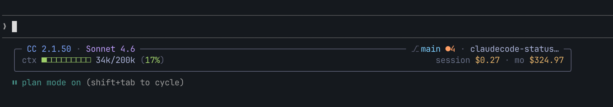

# claudecode-statusline

A minimal, information-dense status display for [Claude Code](https://claude.ai/code) that renders after every response. Shows model, git state, context window usage, and monthly spend — all in a responsive bordered box.



---

## What it looks like

**XL layout (≥80 cols) — normal session:**
```
 ╭─ CC 1.2.3 · claude-sonnet-4-6 ───────────── ⎇ main ●3 · my-project ─╮
 │ ctx ■■□□□□□□□□ 50k/200k (25%)         session $0.15 · mo $48.30 +42/-7 │
 ╰─────────────────────────────────────────────────────────────────────────╯
```

**XL — high context (≥75%), guard mode active:**
```
 ⎇ main ●3
 ╭─ CC 1.2.3 · claude-sonnet-4-6 ──────────────────────── my-project ─╮
 │ ctx ■■■■■■■■□□ 176k/200k (88%) ▲            session $2.40 · mo $214 │
 ╰──────────────────────────────────────────────────────────────────────╯
```

> Guard mode moves git info to a sacrificial plain-text row on line 1, freeing the box header from competing with CC's notification overlay. See [Guard mode](#guard-mode) below.

**L layout (60–79 cols):**
```
 ╭─ CC 1.2.3 · claude-sonnet-4-6 ──── ⎇ main ✓ ─╮
 │ ctx ■■□□□ 50k/200k (25%)    s:$0.15 m:$48 +3/-1 │
 ╰───────────────────────────────────────────────────╯
```

**M layout (40–59 cols):**
```
 claude-sonnet-4-6 ⎇ main ✓
 ■■□□□ 25%  s:$0.15 m:$48
```

**S layout (<40 cols):**
```
 ■■□□□ 25% s:$0.15 m:$48
```

### Color scheme

Themed on [Tokyo Night Storm](https://github.com/folke/tokyonight.nvim). Requires a terminal with 24-bit truecolor. A basic ANSI fallback is available for other terminals.

| Element | Color |
|---------|-------|
| CC version | Blue |
| Model name | Mauve |
| Git branch | Sky |
| Clean ✓ | Green |
| Dirty ● | Orange |
| Context bar (normal) | Green |
| Context bar (80%+) | Yellow + ▲ |
| Context bar (90%+) | Red + ▲ |
| Lines added | Green |
| Lines removed | Red |
| Costs | Yellow |
| Vim/agent badges | Blue |

---

## Features

- **Responsive tiers** — XL / L / M / S layouts based on actual terminal width (detected via process tree, not `tput`)
- **Model & version** — CC version and active model at a glance
- **Git state** — branch name, clean ✓ or dirty ●N indicator
- **Context bar** — 10-block (or 5-block) progress bar with k/k token counts and % usage
- **Guard mode** — when notifications would collide with the box header, git moves to a plain-text sacrificial row on line 1 so the box below stays intact
- **Cost tracking** — session cost + monthly total via [ccusage](https://github.com/ryoppippi/ccusage) (cached, non-blocking)
- **Lines changed** — `+N/-N` diff stats from the current session
- **Vim mode badge** — `[N]` / `[I]` / `[V]` when vim mode is active
- **Agent badge** — `@agent-name` when a subagent is running
- **Smart truncation** — long branch/directory names get `…` rather than silent clipping
- **Truecolor + fallback** — Tokyo Night Storm palette with basic ANSI fallback

---

## Requirements

| Dependency | Purpose | Install |
|------------|---------|---------|
| `bash` 4+ | Script runtime | pre-installed on macOS/Linux |
| `jq` | Parse Claude Code JSON input | `brew install jq` |
| `bun` | Run ccusage | [bun.sh](https://bun.sh) |
| `git` | Branch + status | pre-installed |

**Optional:** `gtimeout` (macOS: `brew install coreutils`) or `timeout` (Linux built-in) for ccusage fetch timeout.

> **Monthly cost display:** If `bun` is installed, the script runs `bunx ccusage monthly` which automatically downloads and executes [ccusage](https://github.com/ryoppippi/ccusage) on demand — no separate install needed. If `bun` is not installed, the `mo` field shows `N/A` and everything else works normally.

---

## Installation

### 1. Clone or download

```bash
git clone https://github.com/clementiano9/claudecode-statusline.git
# or just download statusline.sh directly
```

### 2. Make executable

```bash
chmod +x statusline.sh
```

### 3. Register as a Claude Code hook

Add to your `~/.claude/settings.json`:

```json
{
  "hooks": {
    "Stop": [
      {
        "matcher": "",
        "hooks": [
          {
            "type": "command",
            "command": "/path/to/statusline.sh"
          }
        ]
      }
    ]
  }
}
```

Replace `/path/to/statusline.sh` with the absolute path to where you cloned the script.

Claude Code pipes session JSON to the hook on stdin — the statusline reads it and renders to stdout.

---

## Configuration

Set these in the `env` section of `~/.claude/settings.json` or export them in your shell:

```json
{
  "env": {
    "STATUSLINE_SIMPLE_COLORS": "1"
  }
}
```

| Variable | Default | Description |
|----------|---------|-------------|
| `CLAUDE_CONFIG_DIR` | `~/.claude` | Path to Claude config directory |
| `STATUSLINE_SIMPLE_COLORS` | `0` | Set to `1` for basic ANSI colors (terminals without truecolor) |
| `STATUSLINE_PLAIN_STATUS` | `0` | Set to `1` to disable all ANSI colors |
| `NO_COLOR` | unset | Standard env var — disables colors when set to any value |
| `STATUSLINE_WIDTH` | (auto) | Override the auto-detected terminal width (useful for testing) |
| `STATUSLINE_MAX_WIDTH` | `120` | Cap the box width on very wide terminals |

---

## Guard mode

CC notifications render on the same row as the statusline's first line, and they take priority (`flexShrink:0`). When there isn't enough horizontal space for both, CC squashes the statusline's line 1.

The statusline uses two strategies to stay readable:

1. **Normal mode** — box header on line 1 with git info inline. Used when there's room.
2. **Guard mode** — git info moves to a plain-text "sacrificial" line 1. The box shifts to lines 2–4. The guard line can get crushed by a notification without breaking the layout, since the cost/context info on lines 3–4 always gets full width.

Guard mode activates automatically when:
- Session cost is `$0.00` (CC hasn't answered yet — a startup notification is likely)
- Context usage reaches 75%+ (autocompact notification imminent)

---

## Context bar

The bar uses CC's authoritative `used_percentage` field when available (CC 1.x+). Falls back to calculating from raw token counts if the field is absent.

Color thresholds:
- `< 80%` — green
- `80–89%` — yellow + ▲
- `90%+` — red + ▲

---

## Testing

You can pipe a JSON payload directly to test the script without running Claude Code:

```bash
# Test XL tier
STATUSLINE_WIDTH=88 bash statusline.sh <<< '{
  "workspace": {"current_dir": "/your/project"},
  "model": {"display_name": "claude-sonnet-4-6"},
  "version": "1.2.3",
  "cost": {"total_cost_usd": 0.15, "total_lines_added": 42, "total_lines_removed": 7, "total_duration_ms": 300000},
  "context_window": {
    "context_window_size": 200000,
    "used_percentage": 25,
    "current_usage": {"input_tokens": 50000, "cache_creation_input_tokens": 0, "cache_read_input_tokens": 0}
  },
  "vim": {},
  "agent": {}
}'

# Test narrower tiers
STATUSLINE_WIDTH=65 bash statusline.sh <<< '...'   # L tier
STATUSLINE_WIDTH=50 bash statusline.sh <<< '...'   # M tier
STATUSLINE_WIDTH=35 bash statusline.sh <<< '...'   # S tier

# Test plain mode (no colors)
STATUSLINE_PLAIN_STATUS=1 STATUSLINE_WIDTH=88 bash statusline.sh <<< '...'
```

---

## Roadmap

- [ ] MCP server display — show active MCP count / names in the header
- [ ] Configurable color themes
- [ ] `STATUSLINE_FORMAT` env var for custom field layout

---

## License

MIT
